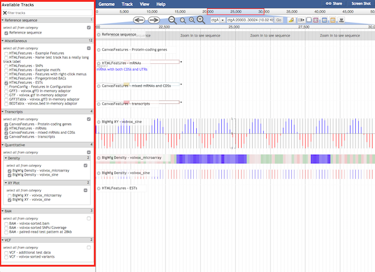

# Hierarchical Checkbox Plugin
Adds a 'select all from category' checkbox to all categories in hierarchical tracklist

When you check/uncheck the box, it applies to all tracks in that category and any subcategories

## Install

For JBrowse 1.11.6+ in the _JBrowse/plugins_ folder, type:  
``git clone https://github.com/bhofmei/jbplugin-hierarchicalcheckbox.git HierarchicalCheckboxPlugin``

**or**

downloaded the latest release version at [releases](https://github.com/bhofmei/jbplugin-hierarchicalcheckbox/releases).  
Unzip the downloaded folder, place in _JBrowse/plugins_, and rename the folder _HierarchicalCheckboxPlugin_

## Activate
Add this to _jbrowse.conf_ under `[GENERAL]`:

    [ plugins.HierarchicalCheckboxPlugin ]
    location = plugins/HierarchicalCheckboxPlugin

If that doesn't work, add this to _jbrowse_conf.json_:

    "plugins" : {
        "HierarchicalCheckboxPlugin" : { "location" : "plugins/HierarchicalCheckboxPlugin" }
    }
    
## Usage

Each category and subcategory will now have a checkbox under the title which says "select all in category". This checkbox can be used to select all or deselect all tracks within that category and subcategories.

When some, but not all, tracks of a category are selected, the checkbox will show an intermediate "check". Clicking this will select all from the category.

There is a known issue where the category check boxes are initially unchecked after page loading.
