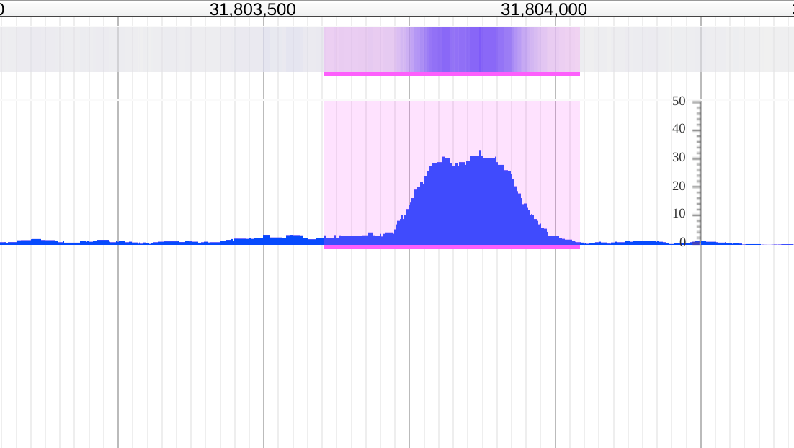

# wigglehighlighter

A JBrowse plugin for plotting a highlight based over a wiggle track. Has been extended to take arbitrary backend for the highlight "store" (highlight regions can come from bigbed or arbitrary storeConf) and also can render of JBrowse XYPlot, Density, or MultiBigWig XYPlot or Density

## Example configs

Example for trackList.json

      {
         "urlTemplate" : "yourfile.bw",
         "bigbed": { "urlTemplate": "yourfile.bb" },
         "label" : "Track",
         "type" : "WiggleHighlighter/View/Track/XYPlot"
         "highlightColor": "#f0f2",
         "broaden": 100
      }

Use general store to load from BEDTabix instead of BigBed, listed in tracks.conf format

    [tracks.wigglehighlighter_bedtabix]
    key=WiggleHighter with BEDTabix
    type=WiggleHighlighter/View/Track/XYPlot
    urlTemplate=volvox_microarray.bw
    storeConf=json:{"storeClass": "JBrowse/Store/SeqFeature/BEDTabix", "urlTemplate": "peaks.bed.gz"}

Configuration on a MultiBigWig track

    [tracks.wigglehighlighter_multi]
    key=WiggleHighter w/ MultiBigWig
    type=WiggleHighlighter/View/Track/MultiXYPlot
    urlTemplates+=json:{"url":"volvox_microarray.bw", "name": "volvox_positive", "color": "#235"}
    urlTemplates+=json:{"url":"volvox_microarray_negative.bw", "name": "volvox_negative", "color": "#a54"}
    storeClass=MultiBigWig/Store/SeqFeature/MultiBigWig
    storeConf=json:{"storeClass": "JBrowse/Store/SeqFeature/BEDTabix", "urlTemplate": "peaks.bed.gz"}
    autoscale=global

Note: this requires MultiBigWig to be installed

## Config

### Store options

* bigbed - object that initializes a bigbed store, listed like "bigbed": {"urlTemplate": "file.bb"}
-- or --
* storeConf - object that initializes a general store, available since version 1.1.0, listed list "storeConf": {"storeClass": "JBrowse/Store/SeqFeature/BEDTabix", "urlTemplate": "file.bed.gz"}

The storeConf is obviously more generic, but was added later. BigBed remains for backwards compatibility

## Visual options

* highlightColor - color probably including some alpha transparency, can be in any color format, default #f0fb
* indicatorColor - color probably for indicator drawn below, can be in any color format, default #f0f
* indicatorHeight - a height for the indicator, defalt 3px
* broaden - number to broaden the drawn peaks by in bp
* type - this plugin has WiggleHighlighter/View/Track/XYPlot and WiggleHighlighter/View/Track/Density track types
* onHighlightClick - A callback on the clicking of the highlight or the indicator
* onHighlightRightClick - A callback on rightclicking of the highlight or the indicator

## Screenshot

Showing default settings on an ENCODE bigbed file and bigwig file with highlighting and broadening of the peak coordinates

## Install

- Clone repo into plugins folder in JBrowse and name folder WiggleHighlighter
- Add "plugins": ["WiggleHighlighter"] to trackList.json or jbrowse_conf.json

Please see http://gmod.org/wiki/JBrowse_FAQ#How_do_I_install_a_plugin for more information about installing plugins

## Demo

See http://localhost/?data=plugins/WiggleHighlighter/test/data once you have installed for small demo dataset

Still in beta! Feel free to provide feedback
